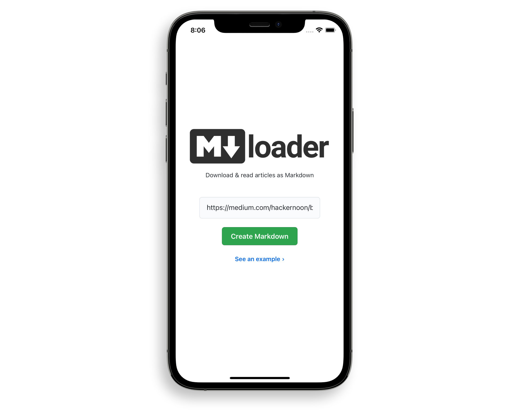
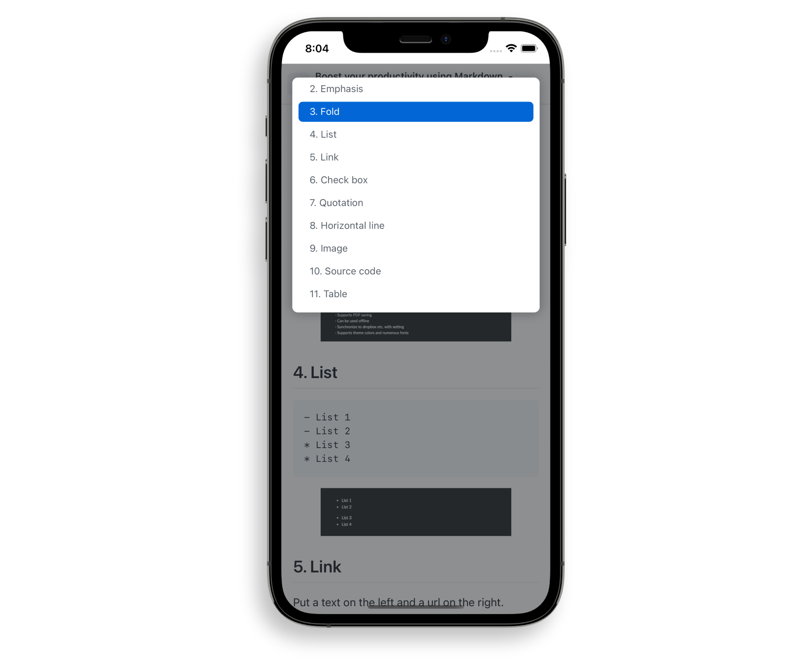
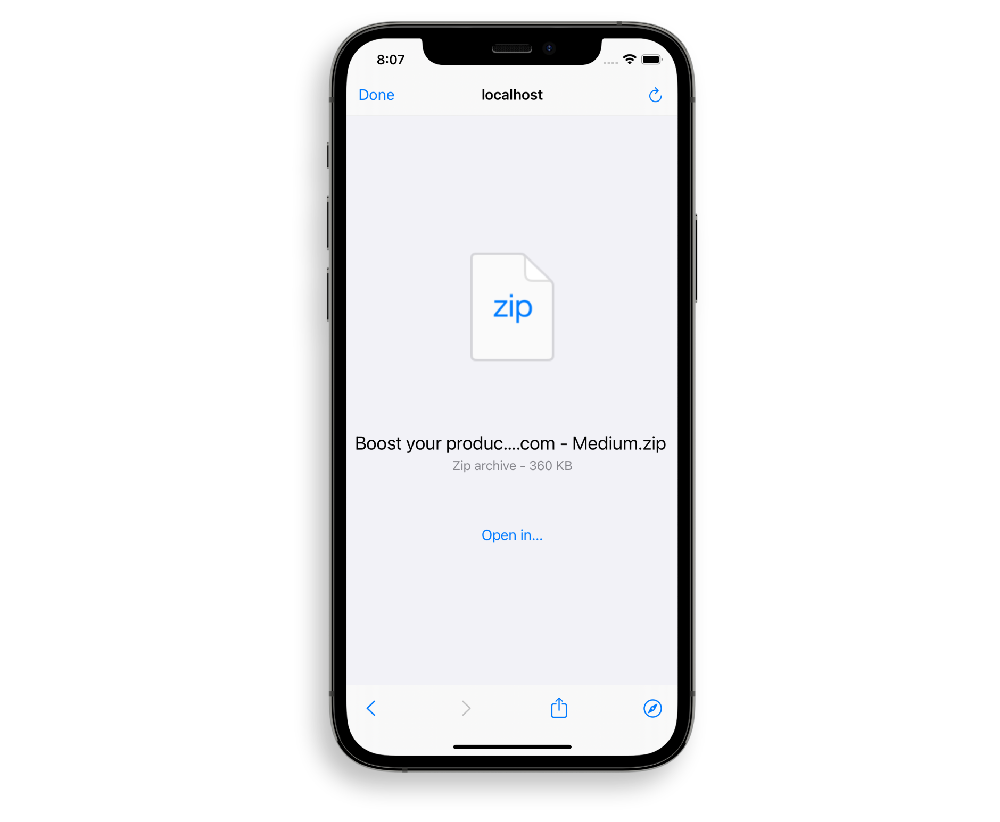

## The Problem

While there exist numerous browser extensions for downloading web pages in an easily archivable format, there currently aren’t any web-based solutions that do not require the installation of additional software.

## The Solution

Create a web app that allows users to quickly paste a link to an article and get back a cleanly formatted markdown file with the option to save it to their device. Ideally, remove any paywalls in the process.

## Outcome

Markdownloader is a web app that allows one to quickly fetch any article and download it as a clean zip file, images included.

It comes styled in the same way as GitHubs Markdown Viewer does, including a dynamically generated Table of Contents with corresponding anchor Links.

Clicking the "Download" button fetches all the images, creates a markdown file and puts it all into a .zip file, replacing any and all absolute image links with relative ones that point to an “assets” folder.

By employing a neat trick, the site also acts as a quick fix to circumvent the annoying paywall problem of medium.com sites, similar to what the popular [Outline.com](https://outline.com/) can do.

<figure>
  
  <figcaption>Enter an URL to an article...</figcaption>
</figure>

<figure>
  
  <figcaption>...get back a GitHub flavored Markdown Viewer..</figcaption>
</figure>

<figure>
  
  <figcaption>...and download to the safe vicinity of your device.</figcaption>
</figure>

## How It Works

Markdownloader uses AWS Lambda magic to get around CORS related issues, by proxying any requests to Netlify’s CDN.

Afterwards, it parses the body of the requested site with Mozilla's [Readability](https://github.com/mozilla/readability) and creates image blobs using the same method of reverse-proxying.

By clicking download, jsZip puts all the files into a folder, with the markdown file parsed by Turndown.

## Technical Details

As for the circumvention of the Medium paywall, Markdownloader uses a similar same method to the beloved Firefox and Chrome extension [medium-unlimited](https://github.com/manojVivek/medium-unlimited), which works by using the [WebExtensions Api](https://developer.mozilla.org/en-US/docs/Mozilla/Add-ons/WebExtensions) to intercept any request to a medium.com URL (or one of their subdomains) and inserts a randomly generated Twitter Referer in the Headers, subsequently fetching the complete version of the article.

However, to make use of this nifty trick myself, I was faced with a problem: While it appears that any medium.com link this way saves the Referer in a global variable, the actual fetching of the article content happens _afterwards_, by making a request to a graphQl database. This is evident in the fact that trying to do the same thing with Javascript turned off won’t load the metered content at all.

To solve this, I tried using jsDoms `runScripts: “dangerously”` option. However, as so often is the case, the lack of a layouting engine made loading the site a gruesome problem, forcing me to rethink this approach.

Since I was restricting myself to using Netlify’s free tier, which has a 10 second execution limit for Lambda functions, another option - firing up a headless chrome instance with the Mediumship extension installed - would not have only been rather anticlimactic, but just as much impractical.

I proceeded with the very generic _Pretend to be Googlebot_ approach. Yet, changing my user agent to Google’s search engine crawler and trying to fetch the site’s body quickly led to me being restricted by Cloudflare's security rules - probably because I wasn’t the first person thinking of that.

This problem could maybe have been solved by having a list of potential Googlebot IP’s and making a reverse DNS lookup before every request, subsequently changing the “X-From” header. However, this too seemed slightly excessive for what I was trying to achieve. (Neither Yandex nor Bing's default crawler agents made life any easier, by the way.)

But while looking through a list of common bots, I stumbled upon one called “Twitterbot 1.0”, which made a lightbulb go off: Perhaps their own crawler doesn’t receive the same scrutiny as external ones?

And indeed, it doesn't. Kinda ironic if you think about it. Fetching any metered article with this user agent works flawlessly, and, in my opinion, is an even better way than using the Referer method, for it doesn't require any additional Javascript loading.

In fact, in certain cases, the Referer method doesn't seem to work at all, while Markdownloader does, as is the case with [this](https://medium.com/coding-at-dawn/how-to-pass-all-props-to-a-child-component-in-react-bded9e38bb62) link.

## Expanding on the Features

Some ideas that float around in my head are to offer an easily installable shortcut for iOS users, letting them fetch any paywalled article with the click of a button in the share menu of Safari.

Something else I considered was offering a GitHub login, giving users the option to save the .md file to one of their repositories, with the images being stored in the .github folder.

If their repository is public, it would essentially mean that they are archiving an article at the click of a button, making it accessible and searchable for anyone on Google, because GitHub Pages automatically creates a website for your repo. Which, of course, is a cool idea.

However, the resulting copyright legalities made me stay away from making this beautiful thought a reality. Maybe you’re in the clear if you’re doing that for archiving purposes, however, I didn’t take the time to investigate further - maybe in the future I will.

Last but not least, I figured that a sensible alternative for saving the data would be a cloud storage provider. Using Firebase was out of the question, since the main appeal was to keep it as frugal and functional as possible; moreover, there exists Pocket, which already offers exactly that.

The point is to make users _not_ have to pay for Pocket, or at least not make them pay more to realize this rather simple concept of easy archival of articles, for that matter.

So before I ditched the idea of using a cloud provider completetly, I took a look at Google Drive. It seemed like a most sensible option, since their free tier is generous enough to afford lots of saving articles, and many people pay for addititonal storage anyway already.

I created a Google Drive oAuth application whose scope is limited to creating files and editing only those it has authorship over. When clicking save to Google Drive, the application would the raw HTML and uploaded it to Google, where it automatically converts it into the Google Docs Mimetype. (Bonus: Any links to images get embedded automatically, so no CORS-proxying needed!)

Sadly, there was a huge flaw: The .docs’ formatting was very screwed up. This includes images going over the bounds of the document, making you have to manually resize them.

I tried injecting some CSS into the Head it, but it doesn’t apply beyond the most basic styling (like `color`). I double checked by downloading and modifying existing Google Docs, but it seems that Google switched over completely to their own .docs parsing engine. Which, to their credit, has been offering an API for a few years now, though its learning curve would break the intended scope of the project for now.

Last but not least, it’s severely worrying to me that Google only saves a reference to a document in the cloud, never the document itself: Even when storing it offline, if its a .docs file, [it’s not really there](https://www.reddit.com/r/Entrepreneur/comments/41iq05/how_we_lost_over_6000_eur_by_not_understanding/) — thus defeating the downloader part in the app's name.

Still, I believe Web Clippers have a lot of potential, and the potential of such a tool is still not used.
